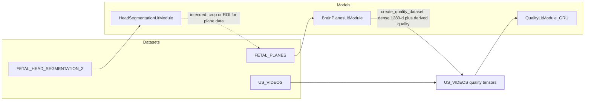
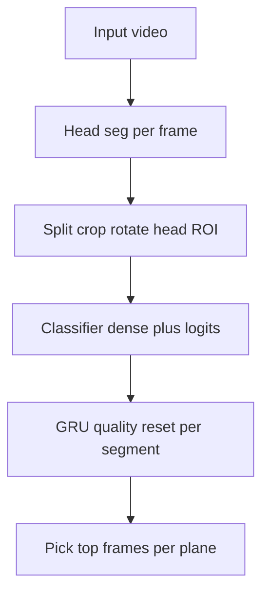

<div align="center">

# Ultrasound fetal images

<a href="https://pytorch.org/get-started/locally/"></a>
<a href="https://lightning.ai/"></a>
<a href="https://hydra.cc/"></a>

</div>

Training and evaluation code for a small **ecosystem** of models on fetal ultrasound: head segmentation, standard-plane classification, and a temporal **quality** model over video. Configurations are composed with **Hydra**; training loops use **PyTorch Lightning**. The repo is also used for **exploration** (for example under `notebooks/`).

A **planned** (not yet implemented as one script) product flow is: given a fetal ultrasound **video**, run the models end-to-end and export the best still frames for the three main neurosonography planes: **Trans-ventricular**, **Trans-thalamic**, and **Trans-cerebellum**.

---

## Stack and layout

| Layer | Role |
|--------|------|
| **Conda** | `environment.yml` is locked to `conda-linux-64.lock`; creates `ultrasound_fetal_images_env` with Python and Poetry. |
| **Poetry** | `pyproject.toml` / `poetry.lock` install PyTorch, Lightning, Hydra, and the rest of the Python dependencies. |
| **Hydra** | Top-level YAML under `configs/` composes data, model, trainer, callbacks, and optional experiments. |
| **Lightning** | `src/train.py` instantiates the datamodule and `LightningModule` from `cfg` and runs fit/test. |

Run all CLI entrypoints from the **repository root** so `rootutils` sets `PROJECT_ROOT` (used by `configs/paths/default.yaml` for `data/` and `logs/`).

Important paths:

| Path | Purpose |
|------|---------|
| `configs/` | Hydra defaults and experiments per task |
| `src/` | Training scripts, models, and data modules |
| `data/` | Datasets (see table below); not necessarily in version control |
| `logs/` | Typical location for training runs and checkpoints (Hydra output dirs vary by run) |

---

## How the models connect (training)

Each stage can depend on artifacts or assumptions from the previous one. The diagram matches what this repository implements today.



1. **Head segmentation** is trained on **`FETAL_HEAD_SEGMENTATION_2`** (`HeadSegmentationDataset` in `src/data/components/dataset.py`). The model is a U-Net (`HeadSegmentationLitModule`, `configs/model/head_segmentation.yaml`): it predicts a **brain mask** and a **binary frame label** (whether the frame is treated as “head” vs not), derived from the predicted mask versus ground truth in the CSV.

2. In the intended workflow, the **best** head-segmentation checkpoint is used **outside** this repo’s single train script to **crop or normalize** inputs so that plane classification sees head-centric frames. The **plane classifier** is trained on **`FETAL_PLANES`** (`FetalBrainPlanesDataset`, `configs/data/brain_planes.yaml`).

3. The **brain planes** model (`BrainPlanesLitModule`) uses a backbone that returns **`(dense_features, logits)`**: a fixed-size embedding (1280 dimensions for the default MobileNetV3-small head in `src/models/components/mobilenet.py`) and class logits.

4. **`src/create_quality_dataset.py`** (config: `configs/create_quality_dataset.yaml`) loads a **brain-planes** checkpoint, decodes videos under **`US_VIDEOS`**, and writes per-frame tensors (dense vectors, derived **quality** scalars, and argmax predictions) under `data/US_VIDEOS/...`. That material is what **`VideoQualityDataModule`** / `VideoQualityMemoryDataset` consume.

5. **Video quality** training (`QualityLitModule` in `src/models/quality_module.py`) stacks **GRUs** with `input_size=1280` on sequences of those saved dense vectors, with regression targets from the quality signal produced in `create_quality_dataset` (smoothed probabilities and a heuristic over the first three plane-related channels).

**Class labels (authoritative for the default config):** `FetalBrainPlanesDataset.labels` lists three standard planes plus `"Not A Brain"`. The default `configs/model/brain_planes.yaml` sets `num_classes: 4`. The **product goal** of picking the best frame per **Trans-ventricular**, **Trans-thalamic**, and **Trans-cerebellum** is aligned with the first three indices; non-plane frames are filtered using classifier outputs and (once wired in inference) quality scores.

---

## Planned end-to-end inference (single video → three best images)

There is **no** unified CLI yet that takes one user video and writes three images. The target pipeline is:



Intended steps:

1. **Head segmentation**, frame by frame: binary “belongs to head” signal and **segmentation map** (ROI).
2. **Segment the timeline** into subsequences that contain the head; **rotate and crop** so the head fills the frame (standardized input to the plane model).
3. **Plane classifier**: for each processed frame, use **backbone dense features** and **logits** (same split as in training).
4. **Quality RNN**: run the trained GRU stack on sequences of **1280-dimensional** dense inputs; **reset hidden state** between temporal cuts (between head-only segments).
5. **Selection**: combine per-frame **plane predictions** with **RNN quality** to choose the single best (or top-k) frame for each of the three main planes for export.

Steps 1 and 3–4 map directly to existing modules; step 2, explicit **state resets** on cuts, and the final export script are the main **glue** to implement.

---

## Tasks, configs, and data

| Task | Hydra entry script | Top-level config | Datamodule (default) | Default data folder under `data/` |
|------|-------------------|------------------|----------------------|-------------------------------------|
| Head segmentation | `python src/head_segmentation_train.py` | `configs/head_segmentation_train.yaml` | `HeadSegmentationDataModule` | `FETAL_HEAD_SEGMENTATION_2` |
| Brain / fetal planes | `python src/brain_planes_train.py` | `configs/brain_planes_train.yaml` | `BrainPlanesDataModule` | `FETAL_PLANES` (`data_name`) |
| Video quality (GRU) | `python src/video_quality_train.py` | `configs/video_quality_train.yaml` | `VideoQualityDataModule` | `US_VIDEOS` |
| Quality dataset build | `python src/create_quality_dataset.py` | `configs/create_quality_dataset.yaml` | (scripted; uses `BrainPlanesLitModule` checkpoint) | reads/writes `US_VIDEOS` layout per script |

Evaluation (test set + checkpoint):

- `python src/head_segmentation_eval.py` with `configs/head_segmentation_eval.yaml`
- `python src/brain_planes_eval.py` with `configs/brain_planes_eval.yaml`

There is a `configs/video_quality_eval.yaml` but **no** matching `src/video_quality_eval.py` in this tree; use training config overrides or add a small eval wrapper if you need parity.

---

## Environment and installation

```bash
make install
conda activate ultrasound_fetal_images_env
```

Updating locks and dependencies is described in [AGENTS.md](AGENTS.md) (`make update`).

---

## Training and Hydra overrides

Use the **task entrypoints** below so the correct `defaults` list (data + model + callbacks) is loaded. Do **not** rely on `python src/train.py` alone: it is the shared implementation module, not a single composed Hydra app. **`make train` is not recommended** until it is wired to a real Hydra config (see [AGENTS.md](AGENTS.md)).

Examples:

```bash
# Head segmentation (CPU or GPU)
python src/head_segmentation_train.py trainer=cpu
python src/head_segmentation_train.py trainer=gpu

# Brain planes with an experiment file from configs/experiment/
python src/brain_planes_train.py trainer=gpu experiment=brain_planes

# Video quality
python src/video_quality_train.py trainer=gpu

# Arbitrary overrides
python src/brain_planes_train.py trainer.max_epochs=20 data.batch_size=64
```

Build the **quality training tensors** after you have a **brain-planes** checkpoint path (directory or file, as expected by Lightning `load_from_checkpoint`):

```bash
python src/create_quality_dataset.py model_path=/path/to/brain_planes/run_or_ckpt
```

Tunable fields (video roots, augmentation grid, window sizes, etc.) live in `configs/create_quality_dataset.yaml`.

---

## Tests and formatting

```bash
make test        # pytest, excluding slow tests
make test-full   # full pytest
make format      # pre-commit on all files
```

---

## Repository map (selected)

| Area | Contents |
|------|----------|
| `src/train.py` | Shared `train()` / `retry_train()` for Lightning fit and test |
| `src/eval.py` | Shared evaluation helper for eval entrypoints |
| `src/models/` | `head_segmentation_module`, `brain_planes`, `quality_module`, backbones under `components/` |
| `src/data/` | Lightning datamodules and `components/dataset.py` |
| `configs/` | Per-task YAML, `configs/experiment/` for pinned hyperparameter sets |
