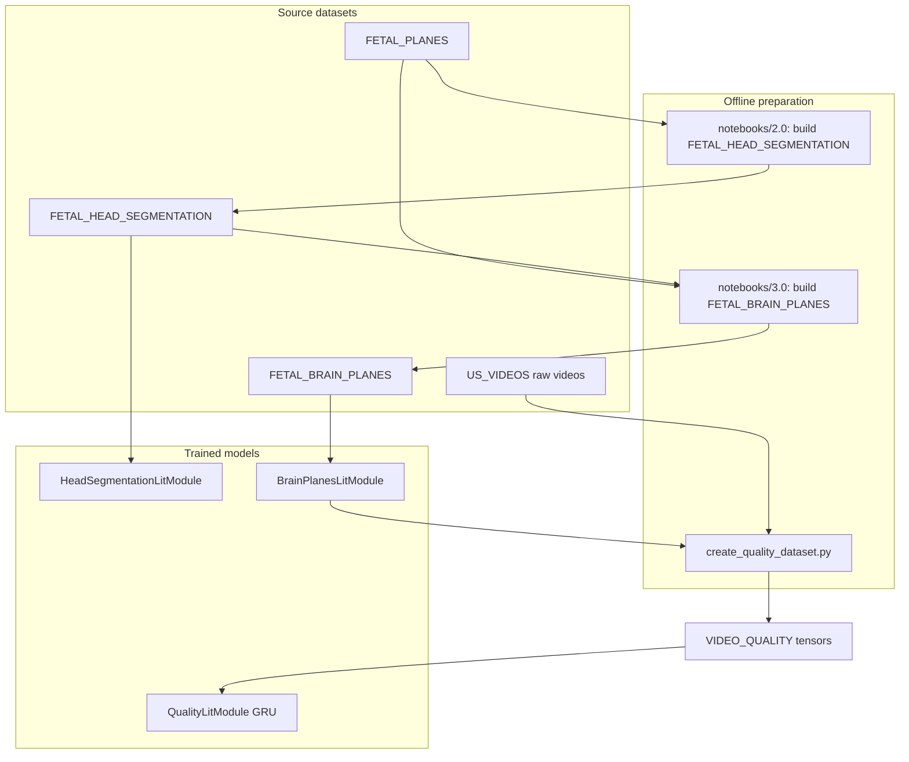
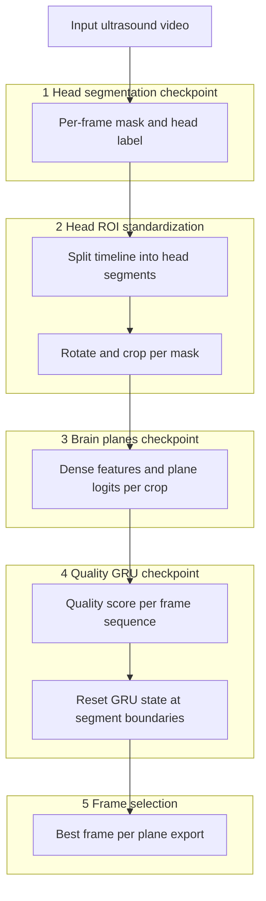

<div align="center">

# Ultrasound fetal images

<a href="https://pytorch.org/get-started/locally/"></a>
<a href="https://lightning.ai/"></a>
<a href="https://hydra.cc/"></a>

</div>

Training and evaluation code for fetal ultrasound ML: **head segmentation** (U-Net mask + frame label), **standard-plane classification** (backbone dense features and logits), and a temporal **quality** model over video (GRU on precomputed dense vectors). Configurations are composed with **Hydra**; training loops use **PyTorch Lightning**. The repo is also used for **exploration** under `notebooks/`.

A **planned** (not yet implemented as one script) product flow is: given a fetal ultrasound **video**, run the models end-to-end and export the best still frames for the three main neurosonography planes: **Trans-ventricular**, **Trans-thalamic**, and **Trans-cerebellum**.

______________________________________________________________________

## Key features

- **Hydra configs** per task under `configs/`, with optional experiment overrides in `configs/experiment/`
- **PyTorch Lightning** training and evaluation via shared [`src/train.py`](src/train.py) and [`src/eval.py`](src/eval.py)
- **Head segmentation**: model for fetal head mask segmentation ([`HeadSegmentationLitModule`](src/models/head_segmentation_module.py))
- **Brain planes**: model for brain planes classification ([`BrainPlanesLitModule`](src/models/brain_planes.py))
- **Quality dataset**: quality frame dataset ([`src/create_quality_dataset.py`](src/create_quality_dataset.py))
- **Video quality**: model for quality assessment ([`QualityLitModule`](src/models/quality_module.py))
- **Notebooks** for exploration and analysis; `make notebook` / `make lab`

______________________________________________________________________

## Prerequisites

- **OS:** Linux x86_64 (Conda environment is locked in [`conda-linux-64.lock`](conda-linux-64.lock) only; see [`environment.yml`](environment.yml))
- **Conda** (Miniconda or Anaconda)
- **Poetry 2.2.x** (installed with Conda)
- **Python 3.12** (installed with Conda)
- **CUDA** (optional, for `trainer=gpu`)

______________________________________________________________________

## Environment setup

From the **repository root**:

1. **Create the Conda environment and install Python dependencies:**

   ```bash
   make install
   ```

   **Manual equivalent** (without `make`):

   ```bash
   conda create --name ultrasound_fetal_images_env --file conda-linux-64.lock
   conda activate ultrasound_fetal_images_env
   poetry install
   ```

2. **Activate the environment** (required for training, tests, and notebooks):

   ```bash
   conda activate ultrasound_fetal_images_env
   ```

[`poetry.toml`](poetry.toml) sets `virtualenvs.create = false`, so Poetry installs into the active Conda env rather than creating a separate virtualenv.

To regenerate Conda locks, update packages, and refresh pre-commit hooks, run `make update` (with the env already active).

______________________________________________________________________

## Stack and layout

| Layer         | Role                                                                               | Files and locations                       |
| ------------- | ---------------------------------------------------------------------------------- | ----------------------------------------- |
| **Conda**     | Creates `ultrasound_fetal_images_env` with Python and Poetry.                      | `environment.yml` / `conda-linux-64.lock` |
| **Poetry**    | Install PyTorch, Lightning, Hydra, and the rest of the Python dependencies.        | `pyproject.toml` / `poetry.lock`          |
| **Hydra**     | Top-level YAML composes data, model, trainer, callbacks, and optional experiments. | `configs/`                                |
| **Lightning** | Training and testing of PyTorch modules.                                           | `src/train.py` and `src/eval.py`          |

Important paths:

| Path       | Purpose                                      |
| ---------- | -------------------------------------------- |
| `configs/` | Hydra defaults and experiments per task      |
| `src/`     | Training scripts, models, and data modules   |
| `data/`    | Datasets; not necessarily in version control |
| `logs/`    | Location for training runs and checkpoints   |
| `tests/`   | Unit, datamodule, and e2e tests              |

______________________________________________________________________

## How the models connect (training)

Each stage depends on datasets prepared in earlier steps (notebooks or scripts). The diagram shows source data, offline preparation, and model training.



1. **`FETAL_PLANES`** — canonical still-image plane dataset (labels, splits). Used upstream; not the final folder for brain-planes training.

2. **`FETAL_HEAD_SEGMENTATION`** — unified head-segmentation dataset built in **`notebooks/2.0-fetal-head-segmentation-data-preparation.ipynb`**, combining several mask sources and **including images and metadata from `FETAL_PLANES`**. Trains **`HeadSegmentationLitModule`** (U-Net mask + binary frame label; `HeadSegmentationDataset`, `configs/model/head_segmentation.yaml`).

3. **`FETAL_BRAIN_PLANES`** — built in **`notebooks/3.0-fetal-brain-planes-data-preparation.ipynb`**: starts from cleaned **`FETAL_PLANES`** metadata, copies images, and writes head-aligned **`_crop.png`** frames using masks from **`FETAL_HEAD_SEGMENTATION`**. Trains **`BrainPlanesLitModule`** on cropped head ROIs (`FetalBrainPlanesDataset`; use `experiment=brain_planes` or `data.data_name=FETAL_BRAIN_PLANES`). The backbone returns **`(dense_features, logits)`**; embedding width depends on the checkpoint backbone.

4. **`VIDEO_QUALITY` (processed)** — **`src/create_quality_dataset.py`** loads a **brain-planes checkpoint**, decodes each frame of raw videos in **`US_VIDEOS`**, and writes per-frame tensors under `data/<dataset_dir>/data/{train,test}/<video>/` (dense features, derived quality, plane preds). On disk, `<dataset_dir>` defaults to **`US_VIDEOS`** in `configs/create_quality_dataset.yaml`; experiment configs may use names like **`US_VIDEOS_tran_0500`**.

5. **Quality GRU** — **`QualityLitModule`** trains on sequences from that processed folder via **`VideoQualityDataModule`**. Set `data.dataset_name` to the same `<dataset_dir>` used in step 4. Dense width must match the brain-planes checkpoint backbone. Regression targets come from the quality signal in `create_quality_dataset` (smoothed probabilities and a heuristic over the first three plane-related channels).

**Class labels (authoritative for the default config):** `FetalBrainPlanesDataset.labels` lists three standard planes plus `"Not A Brain"`. The default `configs/model/brain_planes.yaml` sets `num_classes: 4`. The **product goal** of picking the best frame per **Trans-ventricular**, **Trans-thalamic**, and **Trans-cerebellum** is aligned with the first three indices; non-plane frames are filtered using classifier outputs and (once wired in inference) quality scores.

______________________________________________________________________

## Planned end-to-end inference (single video → three best images)

There is **no** unified CLI that takes one input video and writes three export images. The **target** runtime pipeline reuses the three trained checkpoints in the same order as training, but on a live timeline instead of pre-built datasets:



| Step | What happens                                                                                                                                                                                                                                                             |
| ---- | ------------------------------------------------------------------------------------------------------------------------------------------------------------------------------------------------------------------------------------------------------------------------ |
| 1    | **`HeadSegmentationLitModule`** on every frame: segmentation mask + binary head label                                                                                                                                                                                    |
| 2    | Split the video into **head-only segments** (contiguous frames with head detected). Within each segment, **rotate to principal axis and crop** to a head-filled ROI                                                                                                      |
| 3    | **`BrainPlanesLitModule`** on each cropped frame: **`(dense_features, logits)`** (optionally with TTA). Plane argmax over **Trans-ventricular**, **Trans-thalamic**, **Trans-cerebellum**, **Not A Brain**.                                                              |
| 4    | **`QualityLitModule`** GRU on the sequence of dense vectors **within each head segment**. **Reset hidden state** when a new segment starts (between temporal cuts). Per-frame quality from the trained regressor (training used targets derived in `calculate_quality`). |
| 5    | For each of the three main planes, pick the frame with best combined **plane confidence** and **GRU quality** (e.g. top-1 per plane). Write three still images.                                                                                                          |

______________________________________________________________________

## Tasks, configs, and data

| Task                  | Hydra entry script                      | Top-level config                       | Lightning modules                                  | Lightning Datamodules        | Data under `data/`        |
| --------------------- | --------------------------------------- | -------------------------------------- | -------------------------------------------------- | ---------------------------- | ------------------------- |
| Head segmentation     | `python src/head_segmentation_train.py` | `configs/head_segmentation_train.yaml` | `HeadSegmentationLitModule`                        | `HeadSegmentationDataModule` | `FETAL_HEAD_SEGMENTATION` |
| Brain planes          | `python src/brain_planes_train.py`      | `configs/brain_planes_train.yaml`      | `BrainPlanesLitModule`                             | `BrainPlanesDataModule`      | `FETAL_BRAIN_PLANES`      |
| Quality dataset build | `python src/create_quality_dataset.py`  | `configs/create_quality_dataset.yaml`  | (scripted; uses `BrainPlanesLitModule` checkpoint) | —                            | `US_VIDEOS`               |
| Video quality (GRU)   | `python src/video_quality_train.py`     | `configs/video_quality_train.yaml`     | `QualityLitModule`                                 | `VideoQualityDataModule`     | `VIDEO_QUALITY`           |

Evaluation (test set + checkpoint):

- `python src/head_segmentation_eval.py` with `configs/head_segmentation_eval.yaml`
- `python src/brain_planes_eval.py` with `configs/brain_planes_eval.yaml`

______________________________________________________________________

## Training and Hydra overrides

With the Conda environment active, run from the repository root:

```bash
# Head segmentation (CPU or GPU)
python src/head_segmentation_train.py trainer=cpu
python src/head_segmentation_train.py trainer=gpu

# Brain planes with an experiment file from configs/experiment/
python src/brain_planes_train.py trainer=gpu experiment=brain_planes

# Video quality
python src/video_quality_train.py trainer=gpu

# Arbitrary overrides
python src/brain_planes_train.py trainer.max_epochs=20 data.batch_size=64
```

Build the **quality training tensors** after you have a **brain-planes** checkpoint path (directory or file, as expected by Lightning `load_from_checkpoint`):

```bash
python src/create_quality_dataset.py model_path=/path/to/brain_planes/run_or_ckpt
```

Tunable fields (video roots, augmentation grid, window sizes, etc.) live in `configs/create_quality_dataset.yaml`.

### Quick start (sample data)

One-epoch smoke runs with small public subsets (downloaded via `gdown` when `+data.sample=true`):

```bash
conda activate ultrasound_fetal_images_env

python src/head_segmentation_train.py trainer.max_epochs=1 +data.sample=true
python src/brain_planes_train.py trainer.max_epochs=1 +data.sample=true
python src/video_quality_train.py trainer.max_epochs=1 +data.sample=true
```

______________________________________________________________________

## Tests and formatting

With the Conda environment active:

```bash
make test        # pytest -k "not slow"
make test-full   # full pytest suite
make format      # pre-commit on all files
```

______________________________________________________________________

## Notebooks

With the Conda environment active:

```bash
make notebook   # Jupyter Notebook in ./notebooks
make lab        # JupyterLab in ./notebooks
```
